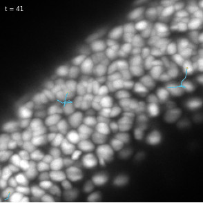
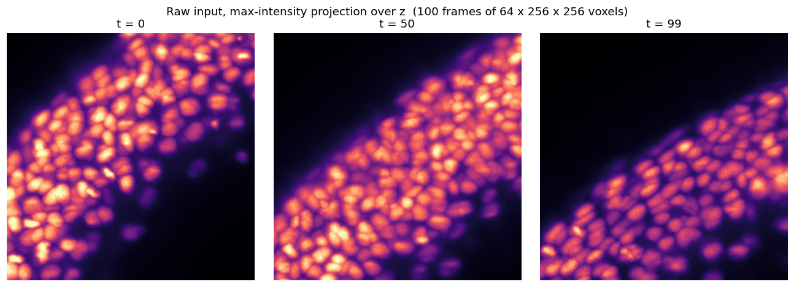
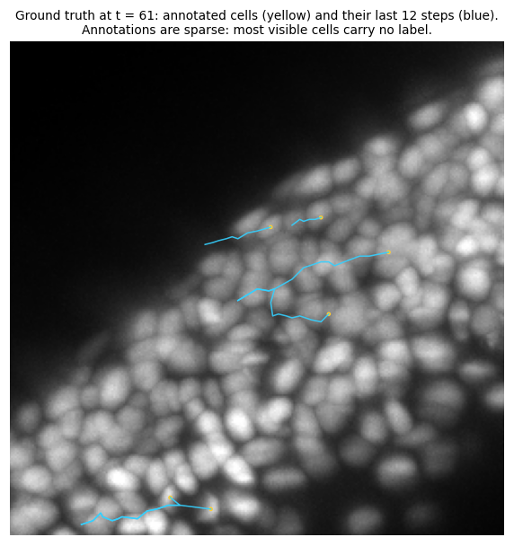
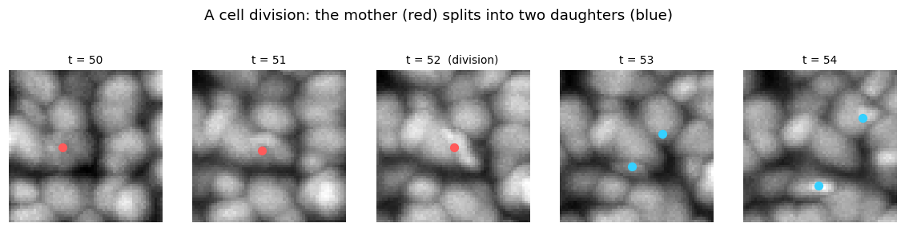
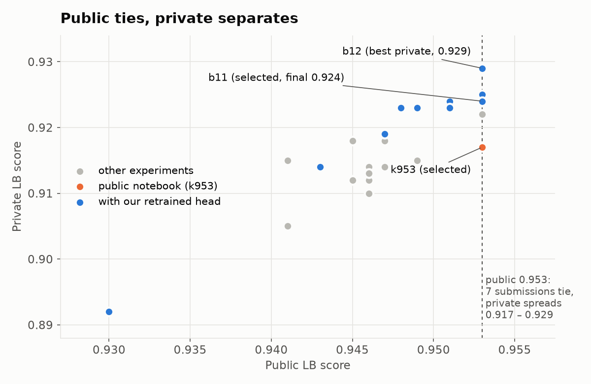
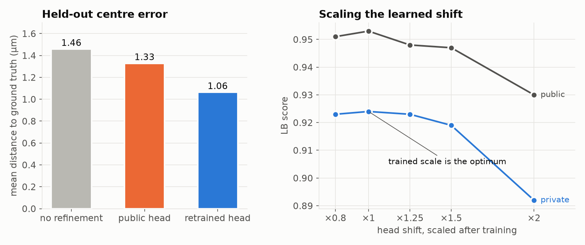
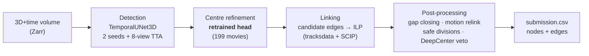
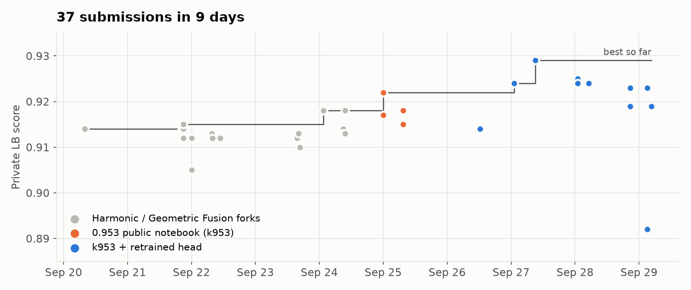
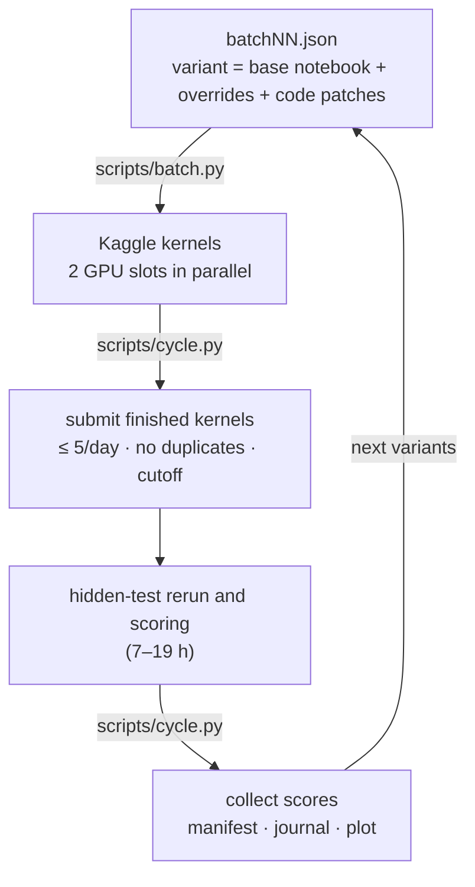

<div align="center">

# Biohub – Cell Tracking During Development

**Detecting and tracking every cell in 3D + time microscopy of zebrafish embryos**

[](https://www.kaggle.com/competitions/biohub-cell-tracking-during-development/leaderboard)
[](https://www.kaggle.com/competitions/biohub-cell-tracking-during-development/leaderboard)
[](#result)


[](LICENSE)



</div>

| | |
|---|---|
| **Result** | 🥈 **Silver medal** — rank **183 of 4,017** teams (top 5%), private LB **0.924** |
| **What made the difference** | Retraining the coordinate-refinement head on all 199 training movies: **+0.007 private** over the public notebook it was built on |
| **Setting** | Solo, joined 9 days before the deadline · 30 GPU h/week · 5 submissions/day |
| **Process** | An automated launch → submit → score loop over 37 scored submissions |
| **On Kaggle** | [Solution write-up](https://www.kaggle.com/competitions/biohub-cell-tracking-during-development/writeups/183rd-place-solution-retraining-the-coordinate-re) · notebooks: [capture A](https://www.kaggle.com/code/ryotakawamura94/biohub-cap-a), [capture B](https://www.kaggle.com/code/ryotakawamura94/biohub-cap-b) → [head training](https://www.kaggle.com/code/ryotakawamura94/biohub-headtrain) → [final submission](https://www.kaggle.com/code/ryotakawamura94/biohub-b11-khead4) |

## The task

Each sample is a 3D movie of a developing zebrafish embryo: 100 frames of 64 × 256 × 256
voxels. The output is a graph with a node for every cell at every frame, an edge linking
each cell to itself in the next frame, and a fork wherever a cell divides.



The ground truth is **sparse**: only some cells are annotated, so the metric scores
predictions near annotated cells and penalises over-predicting the node count.
Divisions are rare and count 0.1× in the score.

| Ground-truth tracks | A cell division |
|---|---|
|  |  |

## Result

Seven of my submissions tied at **0.953** on the public leaderboard, so the public score
gave no signal for choosing between them. I selected the one with a measured, held-out
improvement (b11) plus the unmodified public notebook (k953) as a fallback. On the private
test they separated: **b11 0.924 vs k953 0.917**.



## The idea that worked: retrain the coordinate head

The pipeline refines each detected cell centre with a small head
(224 → 32 → 3 MLP on frozen U-Net features, shift bounded to 2 µm). The public head was
trained on 20 movies. I captured detector features on all **199 training movies**
(111k detection–ground-truth pairs) and retrained it, validating **by movie** so no
movie appears in both train and validation.

- Held-out centre error dropped from **1.33 µm to 1.06 µm**.
- The first submission scored *lower* (0.943). The cause: the head was trained in the
  voxel-centre frame, but the notebook writes coordinates without the centre offset.
  Retraining in the output frame fixed it (b11, 0.953 public / 0.924 private).
- Scaling the learned shift up or down after training only lost score, on both leaderboards.



## Pipeline



The stack is a fork of the strongest public notebooks (see
[Acknowledgements](#acknowledgements)). Every stage is controlled by `BIOHUB_*`
environment variables, so ideas could be tested without retraining the detector.

## What the leaderboard taught

| Finding | Evidence |
|---|---|
| **A held-out gain can be invisible on the public LB and still win on private.** The retrained head tied at 0.953 public but gained +0.007 private. | [figure above](#result) |
| **Single-parameter tuning is a dead end on this plateau.** Every single-setting change I submitted (detection threshold, ILP weights, relink bonus, division gates, shift scale) scored at or below its base. | [manifest](submissions/manifest.csv) |
| **LB loss follows the change in predicted node count**; edge-only changes are the safe direction. | [approach](docs/approach.md#what-the-leaderboard-taught) |
| **The offline proxy does not predict the LB.** A change the proxy scored +0.0005 lost 0.001. | [journal](docs/journal.md) |
| **4 h on the public test can mean > 12 h on the hidden test.** The unmodified 0.948 public notebook timed out; a light rebuild with identical output ran in 26 min. | b04 batch |



## The experiment loop



- **`scripts/batch.py`** turns a JSON entry into a Kaggle notebook: it rewrites the
  fork's hard-coded settings into overridable defaults and applies exact-match code
  patches, failing loudly if a patch anchor is missing.
- **`scripts/cycle.py`** is idempotent (never resubmits a slug, respects the daily limit
  and a cutoff), so it ran unattended on a timer for the whole competition.
- **`scripts/push_kernel.py`** uses the API's quick-save, so editing a notebook does not
  burn a GPU run; **`scripts/gpu.py`** keeps a GPU-hours ledger the API does not expose.

## Repository layout

```
docs/                    task summary, approach, day-by-day journal, figures
notebooks/k953/          public 0.953 notebook the final submissions are built on
notebooks/headtrain/     retrains the coordinate head (CPU)
notebooks/batch/<slug>/  generated submission variants
notebooks/public/        clean notebook for publishing on Kaggle
notebooks/viz/           renders the task figures
experiments/configs/     batch definitions, CV split, GPU ledger
experiments/results/     public and private scores of every submission
harness/                 CV split and a wrapper around the official scorer
scripts/                 batch / cycle / push / scout / gpu / plot tools
submissions/manifest.csv every submission with its change and score
third_party/             official scorer (royerlab, BSD-3)
```

## Reproducing

```bash
pip install -r requirements.txt
kaggle auth login
python notebooks/headtrain/build.py biohub-cap-a biohub-cap-b   # head-training notebook
python scripts/batch.py --config experiments/configs/batch11.json launch
python scripts/cycle.py                                         # submits when finished
python scripts/plot_final.py                                    # README figures
```

All heavy computation runs in Kaggle notebooks (GPU T4 × 2); nothing heavy runs locally.

## Acknowledgements

- Pipeline forked from public Kaggle notebooks (Apache 2.0):
  [kunaldesale2408/biohub-cell-tracking](https://www.kaggle.com/code/kunaldesale2408/biohub-cell-tracking) (0.953),
  [flexonafft/biohub-harmonic-fusion](https://www.kaggle.com/code/flexonafft/biohub-harmonic-fusion) and
  [amanatar/biohub-geometric-fusion](https://www.kaggle.com/code/amanatar/biohub-geometric-fusion).
- Public coordinate head: `anvithpothula/biohub-v1284-head-s075`.
- Model weights and wheels from the datasets by pilkwang
  (`biohub-tracking-support-pack-50ep-v1`, `biohub-temporal-unet3d-seed314159-v1`,
  `biohub-deepcenter-unet3d-center-prior-v1`).
- Official scorer: [royerlab/kaggle-cell-tracking-competition](https://github.com/royerlab/kaggle-cell-tracking-competition) (BSD-3).
- Built with Claude Code as a pair programmer; [`CLAUDE.md`](CLAUDE.md) holds the working rules it followed.

## License

My code and documentation are under the [MIT License](LICENSE). The forked Kaggle
notebooks under `notebooks/` keep their original Apache 2.0 license, and
`third_party/tracking-cellmot` keeps its BSD-3 license.
